```{r setup, include=FALSE}
knitr::opts_chunk$set(echo = FALSE)
```

## The future of big data in developmental science -- How do we answer the big questions? {.flexbox .vcenter}

<div class="centered">
### **Rick O. Gilmore**

Supported by NSF BCE-1147440, NSF BCS-1238599, NICHD U01-HD-076595
</div>

## Big dreams {.flexbox .vcenter .smaller}

<div class="centered">

</div>

Shonkoff, J. P., & Phillips, D. A. (Eds.). (2000). From neurons to neighborhoods: The science of early childhood development. National Academies Press.

<div class="notes">
From neurons to neighborhoods.
</div>

----

<div class="centered">

</div>

<div class="notes">
Even with the domain of neuroscience, we recognize that the phenomena we seek to understand operate across multiple spatial and temporal scales.
</div>

----

<div class="centered"
<a href="http://doi.org/10.1038/nrn1536">
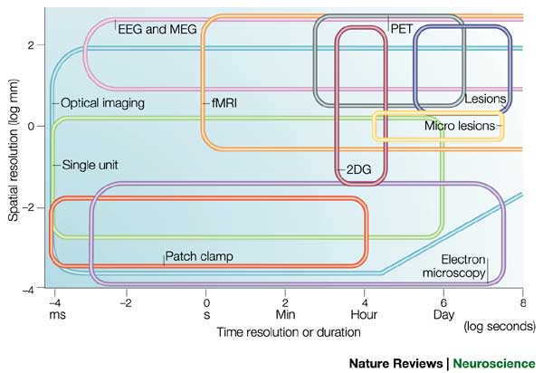
</a>
</div>

<div class="notes">
And that no single method we use operates across the spatial and temporal scales of the phenomena we want to understand.
</div>

## So, how is developmental science doing?

----

<div class="centered">
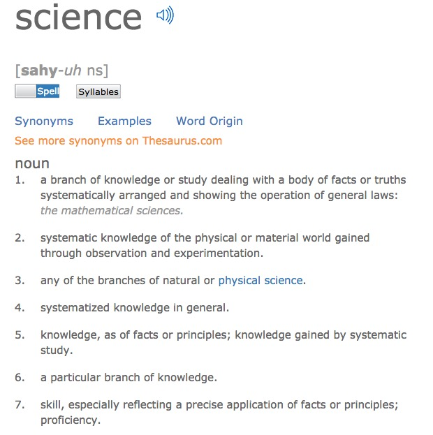
</div>

<div class="notes">
If one definition of science involves 'general laws', then I don't know how far we've come.
</div>

----

<div class="centered">

</div>

<div class="notes">
Much of our research operates in disciplinary, journal, or departmental silos that may or may not fit the phenomenon.
</div>

----

<div class="centered">

</div>

<div class="notes">
And it may often seem like we are the proverbial blind men studying the elephant from Hindu mythology.
</div>

## Challenges with 'big data' developmental science

>- Collect diverse types of data
>- Must aggregate, link data across **space**, **time**, **individual identities**
>- Data not spatially uniform
>- Time series not uniformly sampled, different sampling intervals

----

<div class="centered">

</div>

## Challenges...

- Aggregating big data about individuals poses privacy risks

----

<div class="centered">


</div>

## Challenges...

- Most data collected are from WEIRD populations [[@henrich_weirdest_2010]](http://doi.org/10.1017/S0140525X0999152X)
- Studies underpowered [[@maxwell_persistence_2004]](http://doi.org/10.1037/1082-989X.9.2.147)
- Findings hard to reproduce/replicate

----

<div class="centered">
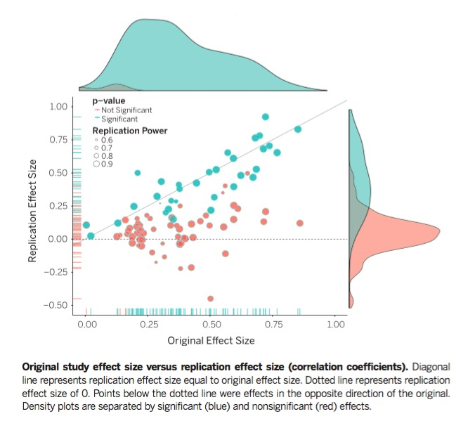

[[@collaboration_estimating_2015]](http://doi.org/10.1126/science.aac4716)
</div>

----

<div class="centered">
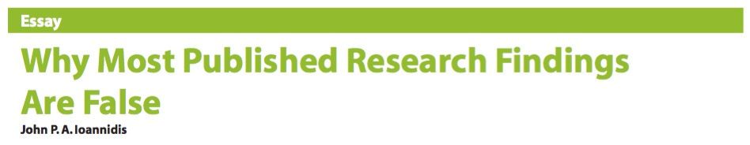

[[@ioannidis_why_2005]](http://dx.doi.org/10.1371/journal.pmed.0020124)
</div>

----

"We have empirically assessed the distribution of published effect sizes and estimated power by extracting more than 100,000 statistical records from about 10,000 cognitive neuroscience and psychology papers published during the past 5 years...**False report probability is likely to exceed 50% for the whole literature. In light of our findings the recently reported low replication success in psychology is realistic** and worse performance may be expected for cognitive neuroscience."

[[@szucs_empirical_2016]](http://doi.org/10.1101/071530)

## Challenges to replicability

>- Still collect data in non-electronic formats
>- Even electronic formats not readily shareable
>- Vital metadata (geo-, participant-level) often not collected
>- "Reproducible" workflows not standard practice 
>- Results have limited robustness and generalizability
>- Misunderstanding/agreement about what reproducibility means

---

- **Methods reproducibility** refers to the provision of enough detail about study procedures and data so the same procedures could, in theory or in actuality, be exactly repeated.
- **Results reproducibility** (previously described as replicability) refers to obtaining the same results from the conduct of an independent study whose procedures are as closely matched to the original experiment as possible.

[[@goodman_what_2016]](http://doi.org/10.1126/scitranslmed.aaf5027)

----

- **Robustness** refers to the stability of experimental conclusions to variations in either baseline assumptions or experimental procedures. It is somewhat related to the concept of **generalizability** (also known as transportability), which refers to the persistence of an effect in settings different from and outside of an experimental framework.

[[@goodman_what_2016]](http://doi.org/10.1126/scitranslmed.aaf5027)

----

<div class="centered">

</div>

<div class="notes">
All of this might lead some of us to despair.
</div>

----

<div class="centered">

</div>

<div class="notes">
But I think this means it's time to roll up our sleeves and follow Rosie the Riveter's lead.
</div>

----

<div class="centered">

</div>

<div class="notes">
Or, to borrow another phrase I like, it's time to go where no one has gone before.
Where might that be, exactly?
To answer that, I have to go back in time a bit.
</div>

## The Year 4 A.D.

- A.D. = After [Databrary](http://databrary.org)

----

<iframe src="http://databrary.org">
</iframe>

----

Gilmore, R. O. (2016). From big data to deep insight in developmental science. *Wiley Interdisciplinary Reviews: Cognitive Science*, *7*(2), 112–126. <https://doi.org/10.1002/wcs.1379>

## Lessons learned

## Big data developmental studies have long histories {.flexbox .vcenter}

<div class="centered">


</div>

## But, big cohort studies have uncertain futures

- [National Children's Study (NCS)](https://www.nichd.nih.gov/research/NCS/Pages/default.aspx)
- [U.K. Life Study](http://www.nature.com/news/massive-uk-baby-study-cancelled-1.18650)

## But, big cohort studies have uncertain futures

- [~~National Children's Study (NCS)~~](https://www.nichd.nih.gov/research/NCS/Pages/default.aspx)
- [~~U.K. Life Study~~](http://www.nature.com/news/massive-uk-baby-study-cancelled-1.18650)

----

<div class="centered">
<iframe src="http://www.developingconnectome.org/">
</iframe>

<div class="notes">
The Developing Human Connectome project in the U.K.
</div>

----

<iframe src="https://www.med.unc.edu/bric/slide-pages/featured-study/baby-connectome-project">
</iframe>

<div class="notes">
The Baby Connectome Project
</div>

## Data sharing is part of the solution, but

- We don't agree about who owns data
    + Participants
    + Us
    + Penn State
    + The taxpayer
- Minimal rewards for data sharing
- Post hoc sharing hard, time-consuming, expensive

----

<iframe src="https://ndar.nih.gov/">
</iframe>

<div class="notes">
The National Database for Autism Research (NDAR)
</div>

----

<div class="centered">
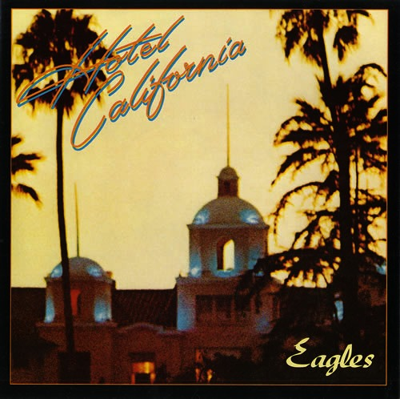

>-*"You can checkout any time you like, but you can never leave."*

## Building a culture of reuse, reanalysis, meta-analysis

- Why share if no one will reuse, build upon?
- Journals don't always encourage/support/mandate publication of data, detailed methods
    + Guidelines for [Transparency and Openness Promotion](https://cos.io/top/#list) from the Center for Open Science (COS)
- Building community consensus better than centralized mandates

## Datasets can be "magnets" for scholarship {.flexbox .vcenter}

<div class="centered">


</div>

<div class="notes">
In the language science domain there is the WordBank archive of MacArthur Communicative Development Inventory (M-CDI) data at Stanford, and the TalkBank archive at CMU.
</div>

## Centralizing shared data can enable discovery

----

<div class="centered">
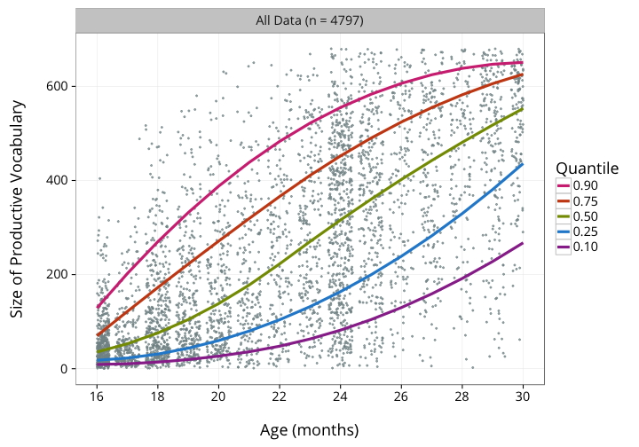

<http://wordbank.stanford.edu/analyses?name=vocab_norms>
</div>

<div class="notes">
Look at what we can do when we have large quantities of data that are organized in a database we can query.
</div>

----

<iframe src="https://nyu.databrary.org/volume/8">
</iframe>

<div class="notes">
Or, let's say I want to look at the NIH race and ethnicity participation in Cathie Tamis-Lemonda's longitudinal study.
</div>

----

<iframe src="https://datausa.io/profile/geo/state-college-pa-metro-area/?compare=new-york-ny#demographics">
</iframe>

<http://datausa.io>

<div class="notes">
Or, here is an example from datausa.io.
</div>

## Video essential

>- Numeric, text-based measures miss/reduce complexity of behavior
>- Video captures and preserves it
>- Replications can fail due to methodological differences
>- Methods sections can't possibly report essential details
>- Video captures and preserves them

[Gilmore et al. talk](https://rawgit.com/databrary/presentations/master/nyu-data-science-reproducibility-16/be-bold.html)

## A robust and reproducible developmental science should…

- Video record all tasks, measures, and behaviors
- Share the recordings
- Share all questionnaires, tasks, displays
- Share statistical, computational, data workflows
- Prepare to share from the beginning
- Seek permission to share data

## Of course, it's hard(er) to collect and share sensitive or identifiable data

- But, not impossible

----

<div class="centered">
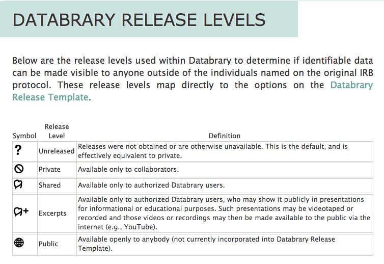
</div>

## When asked, most participants say yes {.flexbox .vcenter .smaller}

<div class="centered">
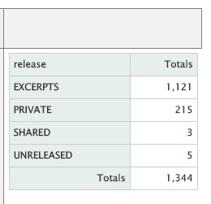
</br>
Tamis-LeMonda, C. (2013). <http://doi.org/10.17910/B7CC74>. 
</div>

----

<div class="centered">
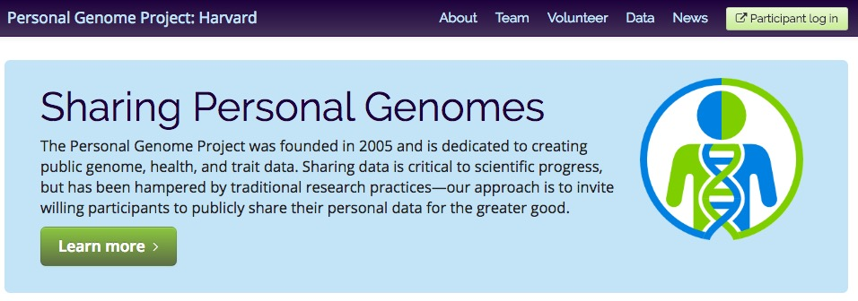
</div>

----

<div class="centered">
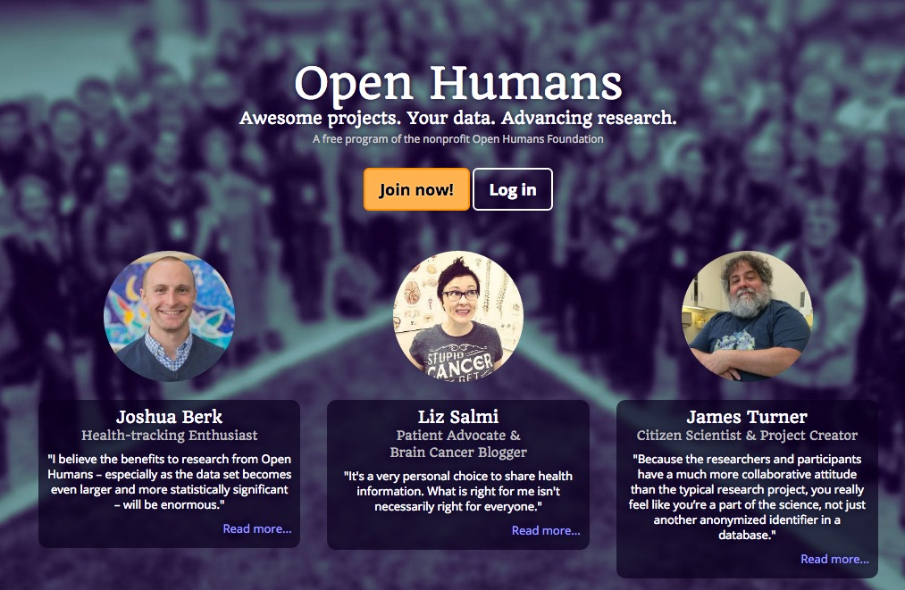
</div>

----

<div class="centered">


<http://www.humanconnectome.org/>
</div>

<div class="notes">
The Human Connectome Project
</div>

----

<div class="centered">
<a href="https://lookit.mit.edu/">
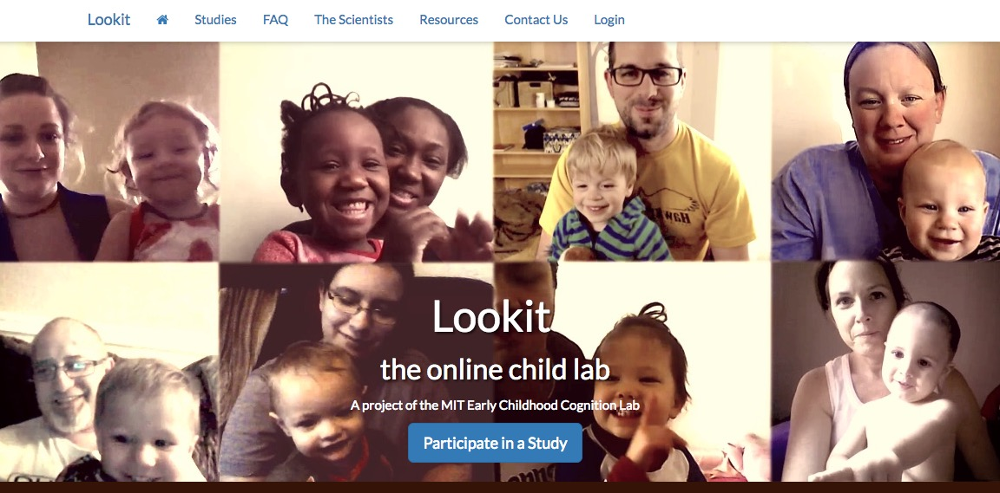
</a>
</div>

## People will *volunteer* information if they get something of value in return {.flexbox .vcenter}

<div class="centered">


</div>

## What is the value of participating in research?

- Contribute to public good
- Aid discovery
- Curiosity
- Help institution
- How can we better capitalize on the value the public places on our work?

## We need better tools, training {.flexbox .vcenter}

<div class="centered">


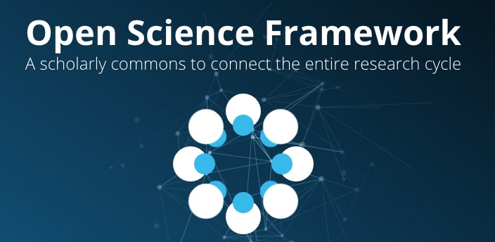
</div>

## Our measures need to be open, non-proprietary

- Are *your* preferred standardized/normed tasks open, non-proprietary?
- Can you share the questions/items with colleagues?
- Are the data underlying the norms openly available?

----

- [Wechlser](http://www.pearsonclinical.com/psychology/products/100000310/wechsler-intelligence-scale-for-children-fourth-edition-wisc-iv.html)
- [Autism Diagnostic Observation Schedule (ADOS)](http://www.wpspublish.com/store/p/2648/autism-diagnostic-observation-schedule-second-edition-ados-2)
- [MacArthur CDI](http://www.brookespublishing.com/resource-center/screening-and-assessment/cdi/)
- [Achenbach System of Empirically Based Assessment (ASEBA), e.g., CBCL, etc.](http://www.aseba.org/)

----

- [~~Wechlser~~](http://www.pearsonclinical.com/psychology/products/100000310/wechsler-intelligence-scale-for-children-fourth-edition-wisc-iv.html)
- [~~Autism Diagnostic Observation Schedule (ADOS)~~](http://www.wpspublish.com/store/p/2648/autism-diagnostic-observation-schedule-second-edition-ados-2)
- [~~MacArthur CDI~~](http://www.brookespublishing.com/resource-center/screening-and-assessment/cdi/)
- [~~Achenbach System of Empirically Based Assessment (ASEBA), e.g., CBCL, etc.~~](http://www.aseba.org/)
- Difficult to find, aggregate across studies, and reuse/reanalyze data drawn from most measures [[@gilmore_big_2016]](http://doi.org/10.1002/wcs.1379)

## We need to think bigger... {.flexbox .vcenter}

<div class="centered">

</div>

<div class="notes">
The space reference is apt. I think there might be something we can learn from other big data science projects like the Hubble Space Telescope.
</div>

----

<div class="centered">

</div>

<div class="notes">
The Hubble Deep Field.
</div>

----

<div class="centered">

</div>

<div class="notes">
Or, the Large Hadron Collider.
</div>

## Imagine a developmental "Databservatory"

<div class="centered">

</div>

----

<div class="centered">

</div>

----

<div class="centered">

</div>

## What would this micro/macro/telescope look like?

>- Recruiting -- larger, more diverse samples
>- Data collection -- more data types, allow linkage across levels
>- Data curation/management -- easy/automatic, standardized formats
>- Data sharing -- PI controls when, permission levels

----

>- Data mining, visualization, linking
>- Search, filter by participant characteristics, tasks/measures, geo/temporal factors
>- Analysis in the "cloud"
>- Automatic versioning, history

----

<div class="centered">
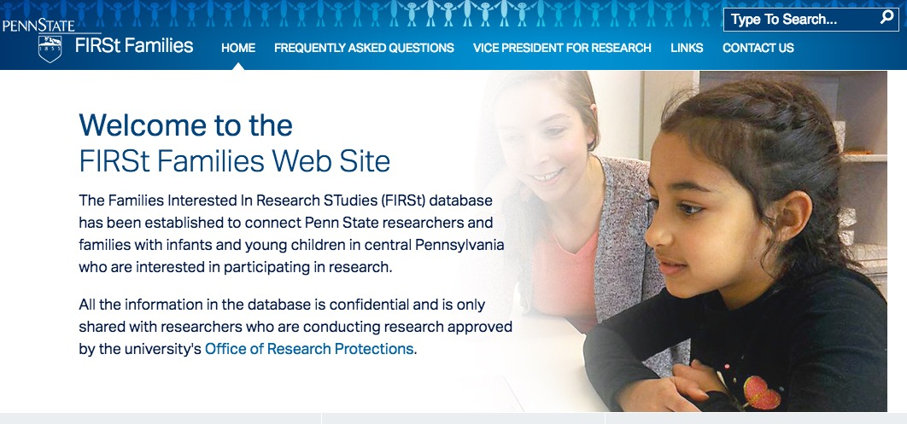
</div>

----

<div class="centered">

</div>

---

<div class="centered">
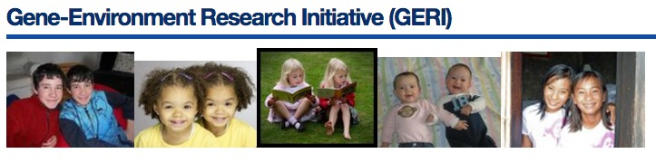
</div>

    
---

<div class="centered">
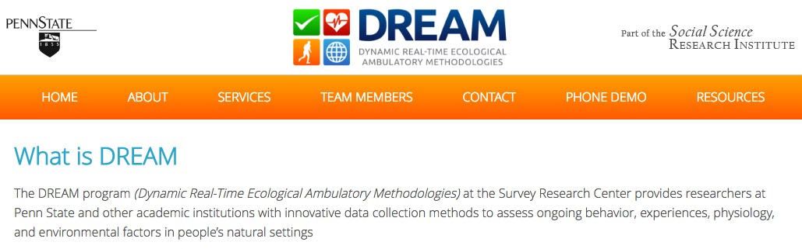
</div>

----

<div class="centered">
<a href="https://autismandbeyond.researchkit.duke.edu/">
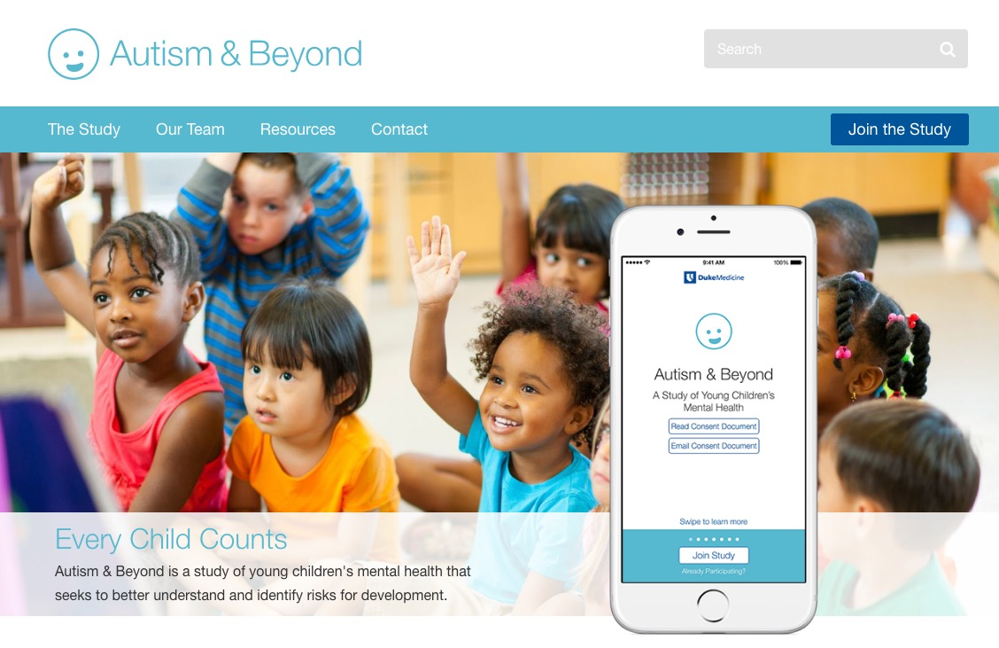
</a>
</div>

----

<div class="centered">
<a href="https://www.mturk.com">
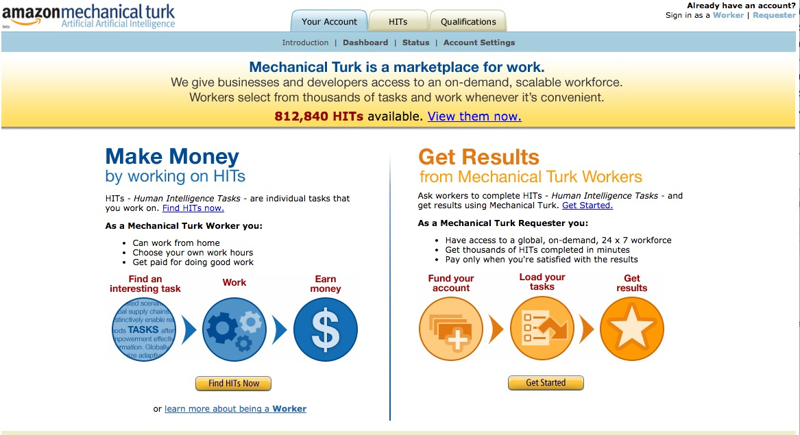
</a>
</div>

----

<div class="centered">

</div>

----

<div class="centered">
<a href="https://lookit.mit.edu/">

</a>
</div>

----

<div class="centered">

</div>

## The front end

>- App/web service (MeeSearch.com)
>- Linking researchers with participants (or parents)
>- Participants own/control their data, determine level of sharing (like datawallet.io)
>- Lab, computer/smart-phone based, survey tasks
>- Data visualizations, dashboard
>- 1,000+ psych pool/semester, 500K PSU alumni, 1M friends

## The middle

<div class="centered">


</div>

----

<div class="centered">
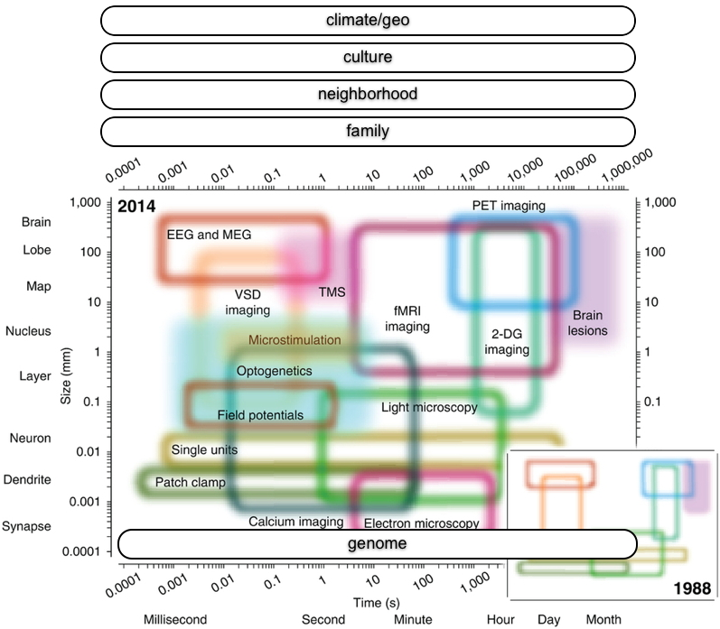
</div>

<div class="notes">
The Databservatory will empower the evaluation and analyses of data streams at multiple levels of spatial and temporal resolution.
</div>

## Analytic/visualization/data publication engine

<div class="centered">


</div>

----

<iframe src="http://datausa.io">
</iframe>

----

<div class="centered">
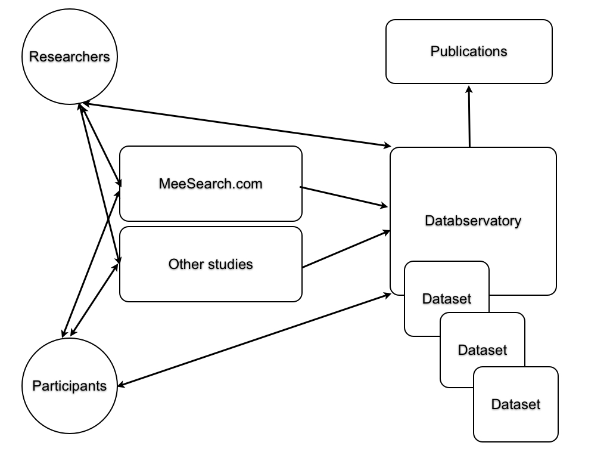
</div>

## What do you think?

- Shall we build it?
- After all...

----

<div class="centered">

</div>

----

<div class="centered">

</div>

## References {.smaller}