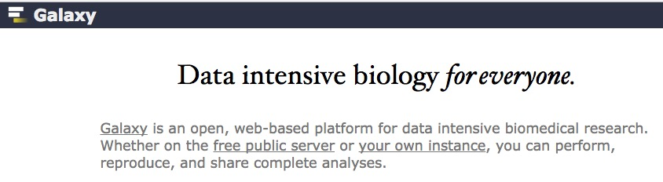

```{r setup, include=FALSE}
knitr::opts_chunk$set(echo = FALSE)
```

## Some problems

## Thinking big...

<div class="centered">

</div>

----

<div class="centered">

</div>

## But...

<div class="centered">

</div>


## Challenges

- Collect diverse types of data
- Some data sensitive
- Most data collected are from WEIRD populations
- Collect data in non-electronic formats
- Electronic formats not readily shareable (FAIR)
- Vital metadata (geo-, participant-level) often not collected -- unknown-knowns

---- 

- Minimal rewards for data sharing
- Post hoc sharing hard, time-consuming, expensive
- "Active" curation not-standardized
- "Reproducible" workflows not standard practice
- Lots of data repositories, but no "databservatories"
- Studies underpowered, findings hard to reproduce/replicate, many/most might be false

----

- Some subfields lack a culture that supports data reuse
- Don't agree who owns data
- Hard to link data across time, space (location), individuals, tasks/measures
- Journals don't always encourage/support/mandate publication of data, detailed methods
- Many standardized "normed" measures are proprietary/commercial and data underlying norms not available.

----

<div class="centered">

</div>

<div class="notes">
All of this might lead some of us to despair.
</div>

----

<div class="centered">

</div>

<div class="notes">
But I think this means it's time to roll up our sleeves and follow Rosie the Riveter's lead.
</div>

## Data as "magnets" for scholarship

<div class="centered">


</div>

<div class="notes">
In the language science domain there is the WordBank archive of MacArthur Communicative Development Inventory (M-CDI) data at Stanford, and the TalkBank archive at CMU.
</div>

----

<div class="centered">


<http://wordbank.stanford.edu/analyses?name=vocab_norms>
</div>

<div class="notes">
Look at what we can do when we have large quantities of data that are organized in a database we can query.
</div>

----

<iframe src="https://nyu.databrary.org/volume/8">
</iframe>

<div class="notes">
Or, let's say I want to look at the NIH race and ethnicity participation in Cathie Tamis-Lemonda's longitudinal study.
</div>


----

<iframe src="https://datausa.io/profile/geo/state-college-pa-metro-area/?compare=new-york-ny#demographics">
</iframe>

<http://datausa.io>

<div class="notes">
Or, here is an example from datausa.io allowing
</div>

## Imagine a developmental "Databservatory""

<div class="centered">

</div>

----

<div class="centered">

</div>

----

<div class="centered">

</div>

----

<div class="centered">

</div>

----

<div class="centered">


<http://www.humanconnectome.org/>
</div>

<div class="notes">
The Human Connectome Project
</div>

----

<iframe src="http://www.developingconnectome.org/">
</iframe>

<div class="notes">
The Developing Human Connectome project in the U.K.
</div>

----

<iframe src="https://www.med.unc.edu/bric/slide-pages/featured-study/baby-connectome-project">
</iframe>

<div class="notes">
The Baby Connectome Project
</div>

----

<iframe src="https://ndar.nih.gov/">
</iframe>

<div class="notes">
The National Database for Autism Research (NDAR)
</div>

----

<iframe src="https://nyu.databrary.org/">
</iframe>

<div class="notes">
The Databrary data library project.
</div>

## What would our ideal look like?

- Recruiting -- larger, more diverse samples
- Data collection -- more data types, allow linkage across
- Data curation/management -- easy/automatic, standardized formats
- Data sharing -- PI controls when, permission levels
- Data mining, visualization, linking
- Search, filter by participant characteristics, tasks/measures, geo/temporal factors
- Analysis in the "cloud"
- Automatic versioning, history

----

| Phase      | Problem                  | Solution      |
|------------|--------------------------|---------------|
| Recruiting | Diversity, sample size   | FIRSt -> MeeSearch |
|            | Permission to share/link | Databrary policies |
| Collection | Non-electronic, formats  | PSU expertise in EMA |
|            | Geo-, other metadata     | MeeSearch     |
|            | Reproducible methods     | Video         |
| Curation   |                          |               |
|            | Non-reproducible workflows | RStudio, Jupyter |
| Publication | Hard to share data + workflows | DOIs   |
| Visualization |                       | Databservatory |
| Discovery |                           | Databservatory |

## MeeSearch -- "Know thyself"

- Linking researchers with participants (or parents)
- Participants own/control their data, determine level of sharing
- Lab, computer/smart-phone based, survey tasks
- Data visualizations, dashboard
- 1,000 psych pool/semester, 500K PSU alumni, 1M friends

## Databservatory

- Studies
    + Measures of People in Settings by Researchers
- Measures
    + Spatial/temporal resolution
    + e.g., questionnaires vs. EEG
- People
    + Personal, family, (friend?) characteristics
- Settings
    + Places, times
    
## Feasibility?

<div class="centered">

</div>

----

<div class="centered">

</div>

----

<div class="centered">

</div>
    
## Using smartphones/tablets/home computers to collect data

<div class="centered">

</div>

----

<div class="centered">
<a href="https://autismandbeyond.researchkit.duke.edu/">

</a>
</div>

----

<div class="centered">
<a href="https://www.mturk.com">

</a>
</div>

----

<div class="centered">
<a href="https://lookit.mit.edu/">

</a>
</div>

## New tools for reproducible workflows

<div class="centered">



</div>
</div>